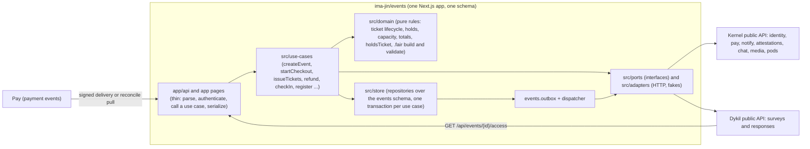

# 02 - Proposed architecture

Design for the re-architected `ima-jin/events` app. Ids R/T/K/I/F refer to `01-current-state.md`. `Dnn` refers to a card in `06-decisions.md`; where a card is still open this document states the recommended choice and says what changes if it goes the other way. `gap(kernel)` items are listed in `05-kernel-gaps.md`.

## 1. Design rules

1. The app owns exactly one Postgres schema, `events`, and its own domain rules. It never reads or writes any other schema (D12 enforces this at the database role, not only by convention).
2. Everything the kernel or another app owns is reached through a small set of typed ports. Each port has one public HTTP adapter and one in-memory fake. Route handlers and domain code never call `fetch` for kernel data.
3. Every port declares its failure policy up front: `required` (the request fails or retries; the outcome cannot be claimed without it) or `deferred` (the effect is written to an outbox in the same transaction as the domain change and delivered later with retry). There is no catch-all "non-throwing helper that returns null".
4. The app is the author of its own domain facts and never the author of someone else's. It reports what happened (ticket issued, ticket checked in) and does not assert money splits or speak as a buyer's identity (D04).
5. Nothing an organizer or door scanner does waits on a kernel round trip that is not strictly needed. Check-in is one database transaction (the app's friction gate: time at the door must not be worse than today).
6. One definition of each concept. "Holds a ticket" is one function used by every surface (D13).
7. No secrets shared with the kernel beyond this app's own registration credentials. No shared-secret webhooks, no kernel internal keys, no private keys in rows that API responses can reach (D06, D09).
8. Published `@ima-jin/*` packages only. Where a package is not published, the app uses the public HTTP API or a link-out, not a copy of kernel code (D18).

## 2. Shape

Directories (names are proposals, not a mandate; the shape is the point):

- `app/` - pages and route handlers only. One page tree (D16).
- `src/domain/` - pure TypeScript, no I/O, unit-tested without mocks: ticket lifecycle state machine, hold and capacity rules, order totals and tax, `.fair` manifest build and validation (via published `@ima-jin/fair`), check-in rules, `holdsTicket()`.
- `src/store/` - the only place SQL exists, only against the `events` schema.
- `src/use-cases/` - orchestration. Each use case opens one transaction, writes domain rows and outbox rows together, and calls `required` ports before commit when the outcome depends on them.
- `src/ports/` and `src/adapters/` - section 3.
- `src/outbox/` - dispatcher (D14).
- `src/auth/authenticate.ts` - the single inbound-auth seam (section 5).

## 3. Ports

| Port | What it does | Kernel or other-app surface | Exists as a public, app-callable surface today? | Policy | Replaces |
|------|--------------|-----------------------------|------------------------------------------------|--------|----------|
| Identity | Resolve DIDs to display names and handles; ensure a guest identity for an email; read a verified contact email | auth lookup, session/soft, profile resolve, registry identity | Partly. Lookup, soft-session and registry identity routes show no guard identifier; profile resolve and contact email need an internal key | `required` for ensure-guest at checkout; `deferred` for display data | K02, K03, K05, K06 |
| Payments | Open a checkout session, read its status, refund an order or ticket, debit balance, set up and charge pledges | pay `checkout`, `refund`, `balance/transfer`, `setup-intent`, `charge-pledges`, session status | Partly. `refund` and `charge-pledges` need a shared service key today (D06); status read not audited | `required` | K07, K08, K09, K10 |
| Notifications | Send a confirmation, receipt, reservation, refund or reminder; send an organizer broadcast | notify send and broadcast | No. Both need a shared webhook secret today (D02) | `deferred` via outbox | K13 and the bus notify reactors |
| Records | Issue attestations for ticket purchase, event creation and attendance | `POST auth /api/attestations` | Route exists and takes a bearer; whether an app may issue about a third-party subject is not established (see `gap(kernel)` list) | `deferred` | bus attestation and emission reactors |
| Chat | Ensure an event lobby, add and remove members, set conversation context | chat `d/{did}/members`, `context`, `participants/migrate` | No. Session or internal key only | `deferred` (the lobby is a convenience, not part of the outcome) | K12 |
| Organizers (D07) | Mirror organizer changes to a kernel pod for trust and chat | connections pods | No. Session only | `deferred`; authorization itself does not depend on it | K11 |
| Media | Upload and serve event images | kernel media service (`@ima-jin/media` is published) | Yes in principle; adapter to be proven in the build | `required` on upload | R54, R64 |
| Forms (D08) | Create or attach a registration survey, submit a registration, read answers | Dykil public API | Yes. Owner export and per-ticket check exist; "answers for N tickets" does not | `required` on submit; `deferred` for projection repair | K15 for `dykil.*` |

Each adapter is a few functions behind an interface. Each fake records calls so use-case tests can assert "the confirmation was queued once" without any network.

## 4. Data model

Baseline: the 8 tables from events#1 are kept as they are. The baseline migration is never edited. All additions are additive migrations generated by `pnpm db:generate` during the build, not written in this docs-only step. Nothing is dropped, including `ticket_transfers` (D19) and `events.private_key` (D09); unused columns are left in place and simply no longer written.

Additions the design needs:

- `events.outbox` - one row per deferred effect: id, kind, target port, payload, idempotency key, attempts, next attempt time, status. Written in the same transaction as the domain change. The dispatcher claims rows with row locking that skips locked rows, so a second process is safe.
- `events.inbound_receipts` - one row per processed external delivery (payment completion, claim, anything signed that arrives from outside), keyed by the external id, so a retried delivery is a no-op. This replaces reliance on "the webhook is only sent once".
- `events.event_organizers` (D07, recommended) - event id, DID, role (`owner` or `cohost`), added by, added at, removed at. The authorization source for organizer actions.
- `events.ticket_attendees` (D08, recommended) - ticket id (primary key), name, email, registration reference (the Dykil response id), registered at. A projection of the minimum the door and the confirmation email need. Full answers stay in Dykil.

Vocabulary and constants:

- Ticket statuses stay `available`, `held`, `valid`, `used`, `cancelled`, `refunded`. `sold` is removed from code and comments; no data migration is needed because it was never written (F01, D13).
- `holdsTicket(ticket)` is `valid` or `used`. It is used by the ticket gate, the "attending" listing, organizer messaging audience, and the chat lobby membership projection. The one place a surface wants something different (for example, showing a refunded ticket in a buyer's history) it says so explicitly.
- `orders.status` default stays `pending` (matches the real database).
- Money stays integer cents, default currency CAD.

Identifiers that must survive the move unchanged: `events.id`, `events.did`, `tickets.id` (the QR code content), `orders.id`, `ticket_types.id`, invite tokens, and `ticket_types.registration_form_id`. This is what makes "old tickets and QR codes keep validating" (#2529) true by construction.

## 5. Authentication and authorization

- One function, `authenticate(request, options)`, returns `{ did, actingDid, scopes, via }` where `via` is `session` or `app-token`. No route imports an auth primitive directly. This is the shape Dykil uses; it keeps a later change of mechanism to one file.
- Machine callers use scoped app tokens: `events:read` (read-only gate and listing) and `events:write` (create and mutate). The kernel can now grant app scopes (#2663 is closed); the exact audience and scope grant for events is an operator step in #2518.
- Organizer actions (edit event, tiers, refunds, check-in, guest list, messaging) are authorized by the event-level rule "caller is an owner or co-host of this event" (`event_organizers`, D07), not by scope alone. A scope says the app may act; the organizer rule says on whose event.
- The delegation policy (`enforceRoutePolicy`) that 11 kernel routes use comes from `@imajin/auth/delegation-policy`. Whether the published `@ima-jin/auth` exports an equivalent was not verified here; the build must confirm it or re-implement the rule in the domain layer.
- Unauthenticated routes are limited to: health, spec, public event read, public tier unlock by code, public campaign status, QR image (it only encodes an id the caller already has), guest checkout, and the registration link. Registration moves from "ticket id is the credential" to "ticket id plus a per-ticket registration token" (see F05; token stored on the ticket row's metadata, created at issue time).
- Upload requires an authenticated organizer and goes to the media port; extension and content type are derived server-side.

## 6. Flows for the four outcome verbs

For each verb: what is on the request path (`required`) and what is deferred.

### 6.1 Create an event

1. Authenticated organizer posts event details. The use case validates, builds the `.fair` manifest (default split from configuration), and inserts the event, an owner row in `event_organizers`, and outbox rows, in one transaction.
2. Event DID: recommended (D09 option b) is that the app registers the event DID as a delegate of the app key through the kernel; until that exists (a `gap(kernel)`), the fallback is today's behaviour of generating a keypair and registering with a signed payload, but the private key is never returned in an API response and never logged.
3. Deferred: chat lobby creation, attestation `event.created`, optional pod mirror, image processing.
4. Response returns the event id, DID and public URL. Nothing in the request waits for chat or attestations.

### 6.2 Sell tickets

All four payment methods share one `startCheckout` use case that creates a `pending` order and `held` tickets (or counts capacity) and then branches:

- Card: create a pay checkout session through the Payments port (`required`), return its URL. Completion arrives through the delivery mechanism in D05; a reconcile job and the success page both read session status and run the same `handlePaymentCompleted` use case, which is idempotent through `inbound_receipts`.
- Free: issue tickets directly.
- e-Transfer: hold for 72 hours; the organizer confirms receipt; the hold sweeper (D14) releases expired holds, replacing "expire when the next request happens" (F13).
- Balance: debit through pay (`required`), then issue.

`issueTickets` (shared by all four) in one transaction: sets order `completed`, sets tickets `valid` with a signature per D09, writes the attendee projection if the buyer registered, and writes outbox rows for confirmation, receipt, lobby membership and attestation. It does not publish any settlement fact; settlement authority is in pay (D04).

Guest buyers: the Identity port ensures a guest identity for the buyer email (`required`, so the ticket has an owner). The email carries a ticket link that works as a capability and an invitation to claim the identity (D11). Claiming later re-owns tickets by verified email at login (D10), replacing the unauthenticated `/migrate-tickets` call (F03).

### 6.3 Buyers get their confirmations

This is the outcome verb the parity port loses. The design:

- `issueTickets` writes a `confirmation` outbox row in the same transaction as the tickets, so a ticket can never exist without a queued confirmation.
- The dispatcher renders the message from templates owned by this repo (D02) and sends it through the Notifications port. The kernel applies the user's notification preferences and delivery.
- Retry with backoff and an idempotency key (`order id + kind`) so a retry cannot double-send.
- An organizer-visible state on each order ("confirmation queued, sent, failed") so a failure is visible instead of silent. A failed confirmation never rolls back the ticket.
- "Resend" (R44) enqueues a new outbox row with a new idempotency suffix.

### 6.4 Check people in

1. Door staff scan the QR (the ticket id) and the client calls the check-in endpoint with the event id and ticket id.
2. One transaction: confirm the caller is an organizer of that event (local table), lock the ticket row, verify it belongs to the event, is `valid` and unused, set `used` and `used_at`, write outbox rows. The response is `200` with the ticket, or `409` with the first check-in time if already used (today this is a generic `400`).
3. Optional, advisory signature check per D09: a valid signature adds a "signature ok" flag; a missing or legacy signature does not block entry. This stays inside the app's claim boundary: a signature shows the ticket record is consistent and attributed to this app, not that the person at the door is who bought it.
4. Deferred: attendance attestation, eligibility evaluation, optional check-in webhook, live count update.
5. No kernel call is on the request path. If the kernel is down the door still works.

## 7. Interfaces that stay or are replaced

Stay as public surfaces (other apps call them):

- `GET /api/events/{id}/access?did=` (R16) with `events:read` and the answer shape `{ "hasAccess": boolean }`, unchanged for Dykil, but computed with `holdsTicket()` (D13).
- Public event read endpoints (R33 read side, R49, R50) for the kernel's own presence tools and chat, until those callers are re-pointed (gaps).
- The OpenAPI document at `/api/spec`, which is the contract and is regenerated from the build.

Replaced (no kernel code calls these any more):

- R65 `/webhook/payment` becomes the receiver for whatever D05 chooses, authenticated by a signature the app verifies, not a bearer shared through two environment names (F06).
- R66 `/webhook/settlement` is removed; settlement data is read from pay when needed (D04) and cached in `orders.fair_settlement`.
- R55 `/migrate-tickets` is removed (D10).
- R01 `/access/[did]` proxy is removed; the browser no longer needs it once kernel chat access no longer reads events tables.

## 8. What must stay identical (the parity set)

These are the behaviours the dev soak (#2529) must prove unchanged. They become the characterization suite, built from events#2's and the kernel's existing tests re-pointed at the new domain layer.

- Ticket, order, event and tier ids; QR content; public event URLs in both historical shapes (D16).
- Pricing, tax and fee math; `.fair` manifest content and settlement snapshots stored on existing orders.
- Capacity, tier access codes, per-order maximums, waiting list order.
- Refund semantics (full, partial, e-Transfer manual).
- Registration status transitions and the guest-list and sales exports (same columns).
- Organizer roles on existing events (owner and co-hosts carried over as rows).

## 9. Intentional changes (not parity)

Each is listed so the soak does not flag it as a regression.

- The ticket gate and "attending" use `holdsTicket()` (fixes F01).
- Registration needs a per-ticket token; upload needs an organizer; `/migrate-tickets` and `/webhook/settlement` disappear (F03, F04, F05, F06). Tickets issued before the move have no registration token, and links already emailed to buyers carry only the ticket id, so those links must keep working while a registration is still pending; the cutoff for that compatibility path is a soak decision (#2529), not decided here.
- Confirmations are queued transactionally and visible, and a failed one is retryable (F07).
- Check-in returns `409` with the first scan time for a repeat scan.
- Event private keys are no longer returned to clients (F02).
- Holds are released by a sweeper (F13).
- Settlement is initiated by pay, not asserted by events (F08).

## 10. Testing and CI

- Unit tests on `src/domain` with no mocks; use-case tests with the in-memory port fakes and a real Postgres (the repo's CI already runs migrations against Postgres); adapter tests against pinned response fixtures stored in this repo. No test reads a path outside the repo (events#2's test opening `../kernel/api-spec/pay.yaml` is the anti-example).
- Port fakes are shared by tests and by a local-dev mode, so the app runs end to end without a kernel.
- Gates are the template's: lint, typecheck, test, build, clean registry install (no `workspace:` and no `@imajin/*`), migrations check, security audit, SonarCloud with zero new issues, CodeQL, markdown control-character check. The files missing from events relative to the template are brought in by the template sync in the re-cut of #2518.

## 11. Deployment and operations

- One pm2 process per environment, same ports and Caddy routes as today, per the template convention. The sweeper and the dispatcher run inside that process (D14).
- Environment contract shrinks to: runtime and base path, database URL and schema, kernel URLs, app registration credentials (DID, registry id, optional attestation id, claim code on first boot only), session secret, and a small set of business settings (platform DID and fee). The six kernel-shared secrets disappear.
- Database: same Postgres server, schema-scoped role that can use only the `events` schema (D12). Any leftover cross-schema SQL then fails loudly in the dev soak instead of passing silently.
- Baseline: the events#1 baseline targets an empty database. Adopting the existing prod and dev schema needs the "refuse on mismatch, never drop" baseline described in the #2518 re-cut, modelled on the Dykil legacy baseline.
- Logging to stdout only; the kernel database log sink (K16) is not used.

## 12. Sequencing constraints

Some kernel work has to exist before parts of this design can ship. The dependencies, not the schedule, are:

- Before the confirmation verb can be demonstrated end to end: a way for an app to send a notification (`gap(kernel)` notify-send under app auth, D02).
- Before the sell verb can complete without shared secrets: a payment-completion delivery or a status read an app can call (D05), and app-scoped refund and pledge rights (D06).
- Before the prune (#2517): kernel chat access stops reading events tables; kernel pay, bus and onboard stop calling events; presence tools use a public read; nav links read the registry. Each is a `gap(kernel)` and each must land before `apps/events` is removed.
- Dykil: events stops reading `dykil.*` (imajin-ai#2542) once the Forms port and the attendee projection exist; Dykil's legacy-table retirement waits on that.
